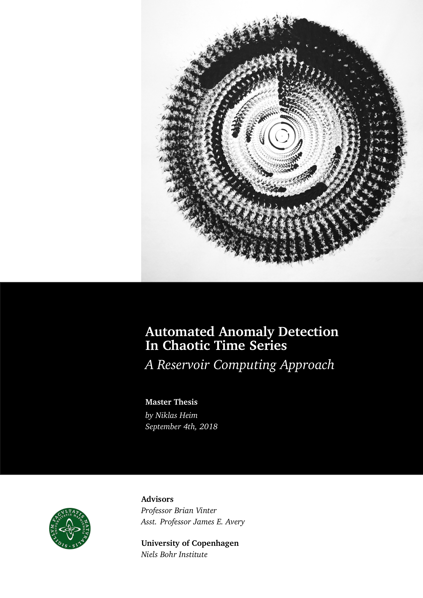

# Automated Anomaly Detection in Chaotic Time Series

This is repository contains my Master's thesis in Computational Physics
and the LaTeX code that I have used to create it.

Feel free to use the slightly customized documentclass `gradient.cls` or the
cover design `hphecker.sty`.

This thesis received the
[award for best](https://www.nbi.ku.dk/english/namely_names/2019/the-prize-for-the-best-thesis-in-computer-science-goes-to-a-physics-student/)
thesis of the year by the
[Danish Society for Computer Science](https://sites.google.com/site/dsfdweb/vindere-af-specialeprisen).
